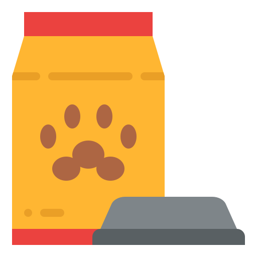

[![LinkedIn][linkedin-shield]][linkedin-url]

 

  

  <h3 align="center">KibbleFinder</h3>
  

    New Way of Finding the Perfect Food for your Best Friend!
     
    <a href="https://www.kibblefinder.com"><strong>To Site »</strong></a>
     
    <a href="https://github.com/PanicGecko/PetsChoice"><strong>Explore the docs »</strong></a>
     
    
  

## About This Project

KibbleFinder turns “Can my dog eat this?” into a one-second query—no more scrolling through endless ingredient lists. Contributions, feature requests, and issue reports are welcome!

KibbleFinder is a web-scraping and recommendation engine that takes the guesswork out of choosing safe, nutritious food for your dog. Give us your pup’s dietary restrictions—anything from common allergens (chicken, wheat, soy) to vet-prescribed ingredient bans—and KibbleFinder scans hundreds of online retailers and brand sites in real time, surfacing only the products that exclude every flagged ingredient.

Why it matters

Dogs with allergies or chronic conditions often react to hidden ingredients buried deep in product labels. Manually vetting each kibble or canned food can be time-consuming and error-prone. KibbleFinder automates that detective work so owners—and veterinarians—can focus on a healthier feeding plan, not label sleuthing.

## Built With
* [![React][React.js]][React-url]
* [![Mongo][Mongo-shield]][Mongo-url]
* [![Nginx][Nginx-shield]][Nginx-url]
* [![Kubernetes][Kubernetes-shield]][Kubernetes-url]
* [![Django][Django-shield]][Django-url]
* [![Celery][Celery-shield]][Celery-url]
* Web Crawler

## Architecture

KibbleFinder allows the user to input all the ingredients that are harmful to your beloved pet through a simple and beutiful UI made with React.js framework. This complex filtering algorithm is able to show the user all the different kinds of food that your pet can have that is built on the Django framework. A web crawler is out there grabbing all the different kinds of pet food that your pet is ready to enjoy!!
All of these services are kept alive through Kubernetes and giving you the best experience by allowing you visit the most traffic optimal route to our service with Nginx.
When you do want to loggin and save your pet profile, Celery is used to help asynchronously verify your account and help us remeber your favorite pets!

## Contact
Adam Chao - [LinkedIn](www.linkedin.com/in/adam-chao)

Project Link: [https://github.com/PanicGecko/PetsChoice](https://github.com/PanicGecko/PetsChoice)

[linkedin-shield]: https://img.shields.io/badge/-LinkedIn-black.svg?style=for-the-badge&logo=linkedin&colorB=555
[linkedin-url]: https://linkedin.com/in/adam-chao
[Mongo-shield]: https://img.shields.io/badge/MongoDB-47A248?style=for-the-badge&logo=apachecassandra&logoColor=white
[Mongo-url]: https://www.mongodb.com
[Nginx-shield]: https://img.shields.io/badge/Nginx-009639?style=for-the-badge&logo=nginx&logoColor=white
[Nginx-url]: https://nginx.org
[Kubernetes-shield]: https://img.shields.io/badge/Kubernetes-326CE5?style=for-the-badge&logo=kubernetes&logoColor=white
[Kubernetes-url]: https://kubernetes.io
[React.js]: https://img.shields.io/badge/React-20232A?style=for-the-badge&logo=react&logoColor=61DAFB
[React-url]: https://reactjs.org/
[Django-shield]: https://img.shields.io/badge/django-092E20?style=for-the-badge&logo=react&logoColor=61DAFB
[Django-url]: https://www.djangoproject.com
[Celery-shield]: https://img.shields.io/badge/celery-37814A?style=for-the-badge&logo=react&logoColor=61DAFB
[Celery-url]: https://docs.celeryq.dev/en/latest/django/first-steps-with-django.html
